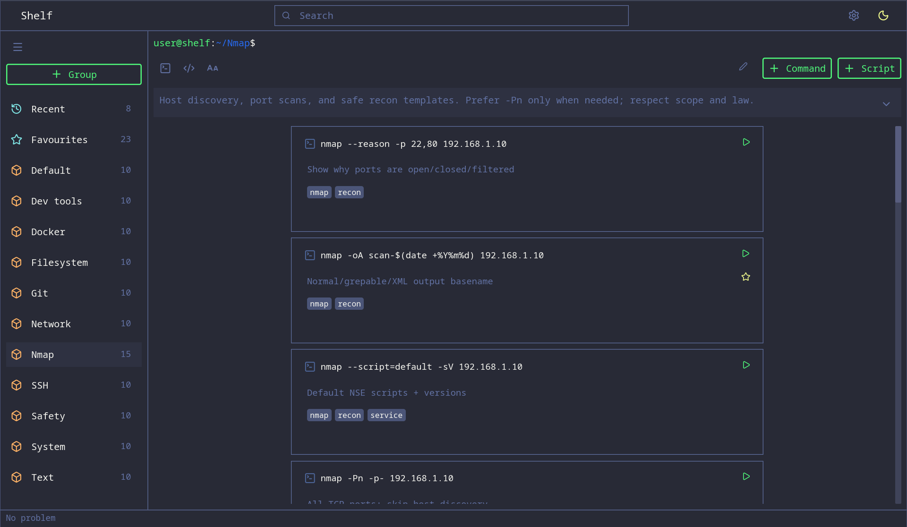
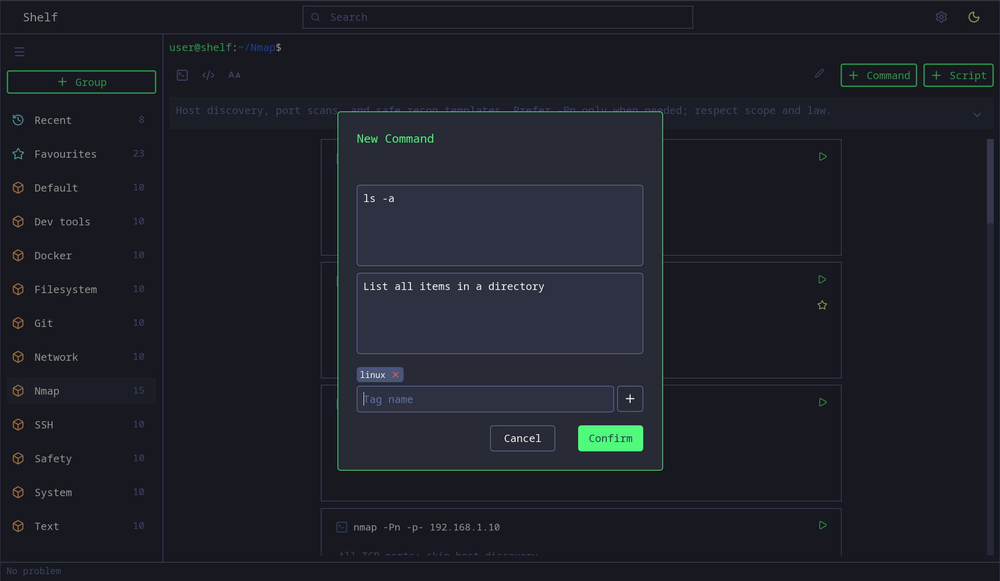

# Shelf

[](https://www.rust-lang.org/)
[](https://iced.rs/)
[](https://sqlite.org/)
[](Cargo.toml)
[]()
[](LICENSE)

A local shelf for the commands you keep reaching for

**Shelf** is a desktop app for collecting, organizing, and running the shell commands and scripts you use all the time. Built for people who live in a terminal but still want a fast, searchable library with groups, tags, and favourites.

>Offline (Your data stays in `~/.shelf`)

>Currently Linux only




---

## What it does

| Capability | Detail |
|------------|--------|
| **Commands & scripts** | Save one-liners or multi-line scripts with optional titles, descriptions, and tags |
| **Groups** | Organize by project, tool, or habit; Default group for unsorted items |
| **Recent & Favourites** | Jump back to what you actually use |
| **Search** | Match on command body, script name, and tags |
| **Copy** | One click to clipboard |
| **Run** *(future)* | Open a real terminal session and execute from the UI |
| **Settings** | Theme, text size, preferred shell / terminal, run behaviour |

Built with **Rust**

---

## Install / run (dev)

```bash
git clone https://github.com/alien5516788/shelf.git shelf
cd shelf
cargo run
```

Requirements:

- Rust toolchain (edition 2024-compatible)
- Linux desktop with a terminal emulator available for Run

Data and config:

```bash
~/.shelf/
  shelf.db          # commands, groups, tags
  settings.json     # theme, shell, terminal, ...
```

---

## Usage (quick)

1. Create a group (or use Default)
2. Add a command or script
3. Tag it if you want it findable later
4. Copy or Run from the card
5. Find it again via search, Recent, or Favourites

---

## Configuration

Settings are stored in `~/.shelf/settings.json`:

```json
{
  "theme": "dark",
  "text_size": "normal",
  "shell": "bash",
  "terminal": "kitty",
  "run_mode": "reuse_session",
  "keep_open": true,
  "screen": "dashboard"
}
```

Theme and text size apply in the UI. Shell / terminal / run mode feed the executor when Run is enabled.

---

## Roadmap

### Prototype (current)

- [x] Local SQLite library of commands and scripts
- [x] Groups, tags, favourites, recent
- [x] Search and clipboard
- [x] Settings and theming
- [ ] Reliable **Run** via terminal + session helper (`shelf-run`)

### Toward 1.0

- [ ] Stable one-job-at-a-time terminal session (busy / idle)
- [ ] Reuse the same terminal window for successive runs
- [ ] Safer quoting and script temp-file execution
- [ ] Search result → jump to group and highlight item
- [ ] Empty states, clearer errors in the status bar
- [ ] Packaging (distro-friendly binary or Flatpak later)

### Later ideas

- [ ] Confirm before running destructive-looking commands
- [ ] Export / import library
- [ ] Parameterized command cards and a composer
- [ ] Broader terminal / shell detection
- [ ] AI integration

---

>shelf — keep your sharpest commands within reach

---
